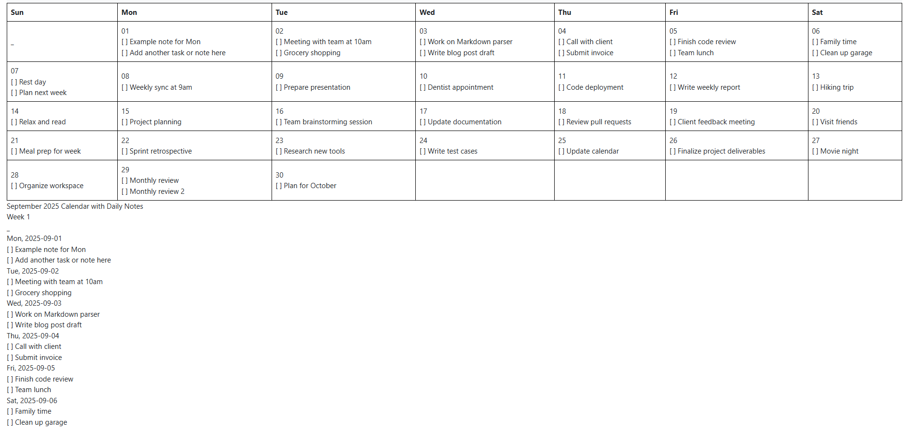

# calendar-md-to-html



## About
```
Library that converts own parsed calendar markdown to html
Published to npm registry
```

## Import this in your application
```bash
pnpm add calendar-md-to-html
yarn add calendar-md-to-html
npm i calendar-md-to-html
```

## Usage 1
```js 
// test.js
const { convertMarkdownToHTML } = require('calendar-md-to-html');
const fs = require('fs');

const md = fs.readFileSync('./examples/sep-2025-calendar.md', 'utf8');
console.log(convertMarkdownToHTML(md));
```

## Usage 2
```ts
// app.ts

```